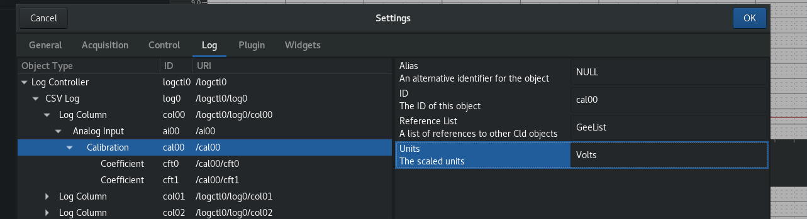

# Dactl Plugin for Measurement Computing USB01208FS

This plugin is an interface between [Dactl](https://github.com/coanda/dactl/)
and the [Measurement Computing USB-1208FS](http://www.mccdaq.com/).

1. [Installation](#installation)
   1. [Dependencies](#dependencies)
   1. [libcld](#libcld)
   1. [dactl](#dactl)
   1. [MCC-USB](#mcc-usb)
   1. [HIDAPI](#hidapi)
   1. [Plugin](#plugin)
1. [Configuration](#configuration)
   1. [Setup](#setup)
   1. [Dactl](#dactl)
   1. [Sampling Rate](#sampling-rate)
   1. [Usage](#usage)
   1. [User Interface](#user-interface)
   1. [Acquisition](#acquisition)
1. [Preferences](#preferences)
   1. [Channel](#channel)
      1. [Tag](#tag)
      1. [Description](#description)
   1. [Calibration](#calibration)
      1. [Units](#units)
      1. [Linear Term](#linear-term)
      1. [Constant Term](#constant-term)
   1. [Save Changes](#save-changes)

## Installation

<!-- TODO: Provide the files separately, along with instructions on installing
### Installing from RPM files

Use the file browser to select and install the following installation packages in the order listed. These files will be provided and may be on a USB stick. Double clicking the file will start the installer.

```sh
libcld-0.4.6-1.fc27.x86_64.rpm
libcld-devel-0.4.6-1.fc27.x86_64.rpm
dactl-0.4.3-1.fc27.x86_64.rpm
```


-->

### Dependencies

Run the following commands from a terminal window

```sh
sudo dnf install git gnome-common intltool gcc vala \
  gtk3-devel clutter-devel clutter-gtk-devel \
  gcc-c++ webkitgtk4-devel libpeas-devel \
  comedilib-devel libusbx libusbx-devel \
  hidapi hidapi-devel
mkdir ~/src
```

#### Comedi

```sh
cd ~/src
git clone https://github.com/geoffjay/comedi-vapi.git
sudo mkdir -p /usr/local/lib/pkgconfig
sudo cp comedi-vapi/comedi.pc /usr/local/lib/pkgconfig/
ver=`vala --version | sed -e 's/.*\([0-9]\.[0-9][0-9]\).*/\1/'`
sudo cp comedi-vapi/comedi.vapi /usr/share/vala-$ver/vapi/
PKG_CONFIG_PATH=/usr/local/lib/pkgconfig/
```

### libcld

```sh
sudo dnf copr enable geoffjay/libcld
sudo dnf install libcld*
```

### dactl

```sh
cd ~/src
git clone https://github.com/coanda/dactl
cd dactl
meson _build
meson configure -Dprefix=/usr _build
ninja -C _build
sudo ninja -C _build install
sudo mkdir -p /usr/lib64/dactl/plugins
```

### MCC-USB

```sh
cd ~/src
git clone https://github.com/wjasper/Linux_Drivers.git
sudo cp Linux_Drivers/61-mcc.rules /etc/udev/rules.d/
sudo udevadm control --reload
sudo udevadm trigger
cd ~/src/Linux_Drivers/USB/mcc-libusb
make
sudo make install
sudo ldconfig
```

#### Vala Build Dependencies

```sh
cd ~/src
git clone https://github.com/coanda/mcc-vapi.git
cd mcc-vapi
sudo cp libmccusb.{deps,vapi} /usr/share/vala/vapi/
sudo cp libmccusb.pc /usr/share/pkgconfig/
```

### HIDAPI

```sh
cd ~/src
git clone git://github.com/signal11/hidapi.git
cd hidapi
./bootstrap
./configure
make && sudo make install
```

### Plugin

```sh
cd ~/src
git clone https://github.com/coanda/dactl-mcc-plugin.git
cd dactl-mcc-plugin
sudo cp vapi/hidapi.vapi /usr/share/vala/vapi/
./autogen.sh --prefix=/usr --libdir=/usr/lib64
make && sudo make install
```

## Configuration

For a working configuration see this [example](https://github.com/coanda/dactl-mcc-config).

### Setup

```sh
cd ~
git clone https://github.com/coanda/dactl-mcc-config.git
sudo mkdir /usr/share/dactl
sudo chown -R `whoami`.$(id -gn `whoami`) /usr/share/dactl
chmod -R g+w /usr/share/dactl
cp dactl-mcc-config/dactl.xml /usr/share/dactl/
```

Running `dactl` with the `mcc-plugin` configuration provided requires a directory for logging.

```sh
sudo mkdir -p /srv/data/dactl
sudo chown -R `whoami`.$(id -gn `whoami`) /srv/data/dactl
chmod -R g+w /srv/data/dactl
```

### Dactl

The configuration file defines the following:
* data acquisition
  * data acquisition devices
  * channel definitions
  * calibrations
  * averaging
  * sampling interval
* data logging
  * log file names
  * channel lists
  * loggin interval
* plugin configurations
  * parameter settings
  * cross referencing to data acquisition configuration
  * controls
  * control placement within the layout
* user interface
  * layout
  * graphs
    * axis
      * labels
      * ranges
      * grid lines
  * channel value tree views
    * channel groups
* log file start/stop controls

Details on editing configuration files will not be described here since many changes can be made through the Dactl user interface "Preferences"
More information on creating configuration files is at [https://dactl.readthedocs.io/en/latest/index.html](https://dactl.readthedocs.io/en/latest/index.html)

### Sampling Rate

Edit the following line int the configuration file in the plugin section to change the rate.

```sh
<ui:property name="sampling-rate">50</ui:property>
```

## Usage

After copying the example configuration it can be used by:

```sh
dactl
```

Or, with a specified configuration file:

```sh
dactl -f path/to/file/configuration.xml
```

## User Interface

Once Dactl has launched with the default configuration the screen should look like this.


### Aquisition

* ensure that the S/N of the USB-1208
* click the "Connect" button
* click the "Acquire" button

### Graph Settings

Double click on the graph you want to change. The screen should look like this.


## Preferences

Changes to some settings can be made while Dactl is running. Others will not take effect until the changes are saved and the program is restarted.
Select "Preferences" from the dactl drop down menu


### Channel

#### Tag

Navigate to the channel settings through starting from the "Log" tab to edit the value.


#### Description

Similarily...


### Calibration

#### Units



#### Linear Term


#### Constant Term


### Save Changes

Changes made to the user preferences can be saved by overwriting the configuration file so a copy should of it should be made before hand if it is neccessary to revert to the original.

Select the gear in th near the top right hand corner and confirm the overwrite.


